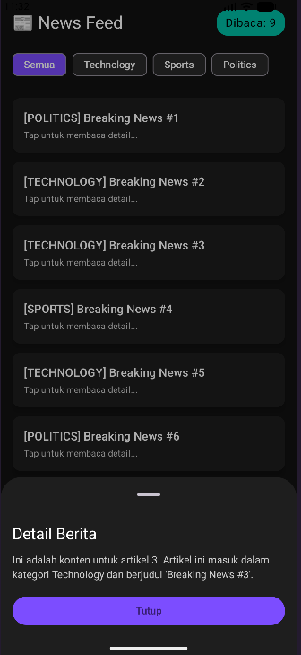

# 📰 News Feed Application

**Nama:** Ahmad Ali Muki  
**NIM:** 123140155

---

## 📋 Daftar Isi
- [Tentang Aplikasi](#tentang-aplikasi)
- [Fitur Utama](#fitur-utama)
- [Requirement](#requirement)
- [Cara Menjalankan](#cara-menjalankan)
- [Struktur Proyek](#struktur-proyek)
- [UI Aplikasi](#ui-aplikasi)

---

## Tentang Aplikasi

News Feed Application adalah aplikasi Android modern yang menampilkan feed berita real-time dengan fitur kategori. Aplikasi ini dibangun menggunakan **Jetpack Compose** dan **Material Design 3** untuk memberikan pengalaman pengguna yang mulus dan responsif.

Aplikasi ini menampilkan berita yang terus-menerus masuk setiap 2 detik, dengan dukungan penyaringan berdasarkan kategori seperti Technology, Sports, dan Politics.

---

## Fitur Utama

### 1. **📊 Real-time News Feed**
   - Berita masuk secara otomatis setiap 2 detik
   - Setiap berita memiliki ID, judul, kategori, dan konten
   - Counter untuk menghitung total berita yang telah dibaca

### 2. **🏷️ Kategori Berita**
   - Filter berita berdasarkan kategori:
     - **Semua** - Menampilkan semua berita
     - **Technology** - Berita teknologi
     - **Sports** - Berita olahraga
     - **Politics** - Berita politik
   - Chip yang responsif dengan highlight ketika dipilih

### 3. **📖 Detail Berita**
   - Tap pada berita untuk melihat detail lengkap
   - Modal bottom sheet untuk menampilkan konten berita
   - Tombol tutup untuk menutup modal

### 4. **🎨 Tema Dark Modern**
   - Custom dark theme dengan warna yang menarik
   - Primary color: Teal (#00BFA6)
   - Secondary color: Purple (#7C4DFF)
   - Background: Dark Gray (#121212)

### 5. **⚡ Reactive Architecture**
   - Menggunakan MVVM (Model-View-ViewModel) pattern
   - StateFlow untuk reactive data management
   - Coroutines untuk operasi asynchronous

---

## Requirement

### Sistem Operasi
- Android 7.0 (API 24) atau lebih tinggi
- Target SDK: Android 15 (API 36)

### Tools & Dependencies
- **Android Studio** versi terbaru
- **Gradle** (wrapper sudah disediakan)
- **Java 11** atau lebih tinggi
- **Kotlin** 2.0+

### Library Utama
- `androidx.compose.ui` - UI Toolkit
- `androidx.compose.material3` - Material Design 3
- `androidx.lifecycle` - ViewModel & Lifecycle management
- `kotlinx.coroutines` - Asynchronous programming

---

## Cara Menjalankan

### 1. **Clone atau Download Proyek**
```bash
cd path/to/tugas2123140155
```

### 2. **Buka dengan Android Studio**
- Buka Android Studio
- Click **File → Open**
- Pilih folder `tugas2123140155`
- Tunggu Gradle sync selesai

### 3. **Setup Emulator atau Device**
- **Menggunakan Emulator:**
  - Buka Android Virtual Device Manager
  - Pilih atau buat emulator dengan Android 7.0 atau lebih tinggi
  - Jalankan emulator

- **Menggunakan Device Fisik:**
  - Hubungkan Android device ke komputer
  - Aktifkan USB Debugging di Developer Options
  - Pastikan device terdeteksi dengan `adb devices`

### 4. **Build dan Run**
```bash
# Menggunakan Android Studio
- Tekan Ctrl + F10 atau Click Run Button (▶)
- Pilih target device/emulator
- Klik OK

# Menggunakan Command Line (Windows)
./gradlew.bat installDebug
```

### 5. **Aplikasi Siap Digunakan**
- Aplikasi akan terbuka secara otomatis
- Tunggu berita masuk (setiap 2 detik)
- Gunakan chip kategori untuk filter berita
- Tap berita untuk melihat detail

---

## Struktur Proyek

```
tugas2123140155/
├── app/
│   ├── src/
│   │   └── main/
│   │       ├── java/
│   │       │   └── ac/id/itera/ahmad/t2/
│   │       │       ├── MainActivity.kt          # Activity utama dengan Compose UI
│   │       │       ├── NewsRepository.kt        # Data source & business logic
│   │       │       ├── data/
│   │       │       │   └── News.kt              # Data model
│   │       │       └── viewmodel/
│   │       │           └── NewsViewModel.kt     # ViewModel untuk state management
│   │       ├── res/                             # Resources (drawable, values, dll)
│   │       └── AndroidManifest.xml
│   ├── build.gradle.kts                         # App-level gradle config
│   └── proguard-rules.pro
├── gradle/
│   └── wrapper/                                 # Gradle wrapper
├── build.gradle.kts                             # Project-level gradle config
├── settings.gradle.kts
├── gradlew & gradlew.bat                        # Gradle wrapper scripts
└── README.md (file ini)
```

### File Penting

| File | Deskripsi |
|------|-----------|
| `MainActivity.kt` | Activity utama yang menampilkan UI Compose dengan NewsScreen |
| `NewsViewModel.kt` | ViewModel yang mengelola state berita dan kategori |
| `NewsRepository.kt` | Repository yang mensimulasikan streaming berita real-time |
| `News.kt` | Data class untuk model berita |

---

## UI Aplikasi

### Screenshot Aplikasi



### Deskripsi UI

**Header Section:**
- Logo "📰 News Feed"
- Counter berita yang telah dibaca dengan background teal

**Category Filter Section:**
- Chip buttons untuk kategori: Semua, Technology, Sports, Politics
- Highlight aktif menggunakan warna purple (#7C4DFF)

**News List Section:**
- Daftar berita dalam Card format
- Setiap card menampilkan kategori dan judul berita
- Teks "Tap untuk membaca detail..." sebagai CTA
- Cards memiliki elevation dan background dark

**Bottom Sheet Modal:**
- Tampil saat berita di-tap
- Menampilkan detail lengkap berita
- Tombol "Tutup" untuk menutup modal

---

## Teknologi yang Digunakan

- **Language:** Kotlin
- **UI Framework:** Jetpack Compose
- **Design System:** Material Design 3
- **Architecture Pattern:** MVVM
- **State Management:** StateFlow, ViewModel
- **Async:** Coroutines, Flow
- **Build Tool:** Gradle

---

## Catatan Pengembang

- Aplikasi menggunakan simulasi data stream yang dihasilkan oleh `NewsRepository`
- Berita baru ditambahkan setiap 2 detik secara otomatis
- Kategori disortir secara random
- Counter "Dibaca" menghitung total berita yang pernah ditampilkan
- Menggunakan custom dark theme untuk pengalaman visual yang lebih baik

---

## Lisensi

Proyek ini dibuat sebagai tugas mata kuliah **PAM (Pengembangan Aplikasi Mobile)** di Institut Teknologi Sumatra (ITERA).

---

## Kontak

Jika ada pertanyaan atau masukan, silakan hubungi:
- **Nama:** Ahmad Ali Muki
- **NIM:** 123140155
- **Institusi:** Institut Teknologi Sumatra (ITERA)

---

**Last Updated:** February 2026

